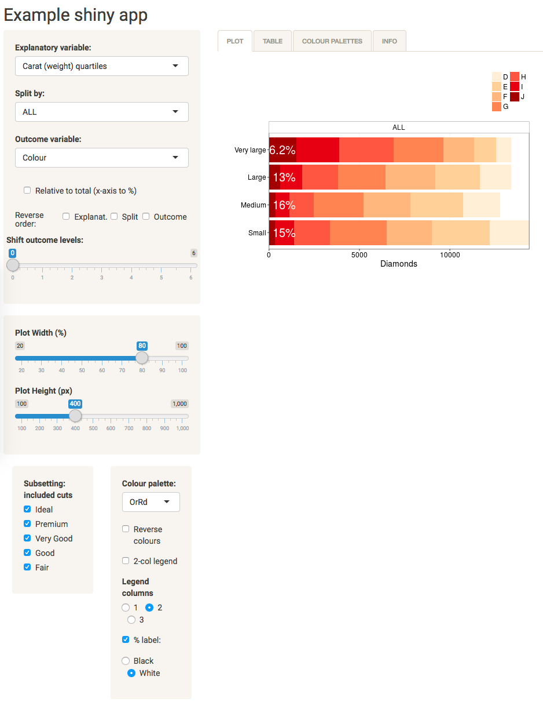

See it in action (quickly run on your computer):
------------------------------------------------

    shiny::runGitHub("shinyviz", "riinuots")

The packages you'll have to have installed:

    library(shiny)
    library(shinythemes)

    library(ggplot2)
    library(tidyr)
    library(dplyr)
    library(forcats)
    library(magrittr)
    library(scales)

Most of these come with `install.packages("tidyverse")` (<http://tidyverse.org/>).

Apply it on your dataset
------------------------

Most of the code in this app very very generecally written so it can be (and has already been) applied to different datasets.

-   Create a new empty RStudio project.
-   Download the `server.R`, ui.R, and `formatted_varnames_forUI.csv` files, put them in your project.
-   Open the scripts `server.R` and `ui.R` in the editor.
-   Click on Run App to make sure it works (this will use the diamonds example dataset).
-   Upload your data into the project.
-   List the categorical variables you would like to be included in the app in formatted\_varnames\_forUI.csv. Keep the first two lines as they are.
-   Run App: check that the dropdown menus now include your variables. The app's Plot tab will now display an Error. This is because it is still using the diamonds dataset, but looking for your variables.
-   Go to ui.R and edit the three linea starting with `default_` to set the variables you want to be shown on app startup. For explanatory1 or exmplanatory2 you can use our dummy variable called "aaa.onepanel" to just plot everything together and leave the splitting to the user.
-   Go to server.R and replace the top bit where diamonds is called with your dataset. You can delete the lines that cut continuous variables into categories as those are specific to the diamonds dataset. Make sure to keep `alldata$aaa.onepanel = "ALL"`.
-   When you run the app now, you should get an error or "match requires vector arguments", that's because we haven't set up the Subetting functionality (and it is still trying to subset for diamond cuts).
-   To be continued...

Session info
------------

``` r
sessionInfo()
#> R version 3.3.1 (2016-06-21)
#> Platform: x86_64-pc-linux-gnu (64-bit)
#> Running under: Ubuntu 14.04.1 LTS
#> 
#> locale:
#>  [1] LC_CTYPE=en_GB.UTF-8       LC_NUMERIC=C              
#>  [3] LC_TIME=en_GB.UTF-8        LC_COLLATE=en_GB.UTF-8    
#>  [5] LC_MONETARY=en_GB.UTF-8    LC_MESSAGES=en_GB.UTF-8   
#>  [7] LC_PAPER=en_GB.UTF-8       LC_NAME=C                 
#>  [9] LC_ADDRESS=C               LC_TELEPHONE=C            
#> [11] LC_MEASUREMENT=en_GB.UTF-8 LC_IDENTIFICATION=C       
#> 
#> attached base packages:
#> [1] stats     graphics  grDevices utils     datasets  methods   base     
#> 
#> other attached packages:
#> [1] scales_0.4.1      magrittr_1.5      forcats_0.2.0     dplyr_0.5.0      
#> [5] tidyr_0.6.0       ggplot2_2.2.1     shinythemes_1.1.1 shiny_1.0.0      
#> 
#> loaded via a namespace (and not attached):
#>  [1] Rcpp_0.12.11     knitr_1.15.1     munsell_0.4.3    colorspace_1.3-1
#>  [5] xtable_1.8-0     R6_2.2.0         stringr_1.2.0    plyr_1.8.4      
#>  [9] tools_3.3.1      grid_3.3.1       gtable_0.2.0     DBI_0.5-1       
#> [13] htmltools_0.3.5  assertthat_0.1   yaml_2.1.14      lazyeval_0.2.0  
#> [17] rprojroot_1.2    digest_0.6.10    tibble_1.2       evaluate_0.10   
#> [21] mime_0.4         rmarkdown_1.6    stringi_1.1.2    backports_1.0.5 
#> [25] httpuv_1.3.3
```
